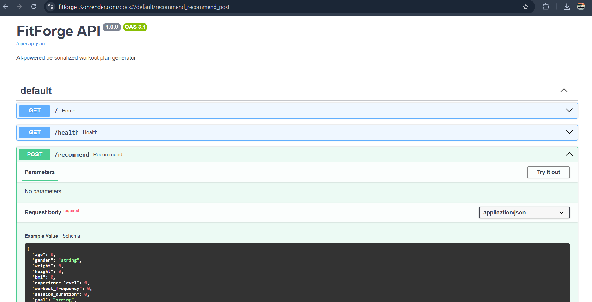
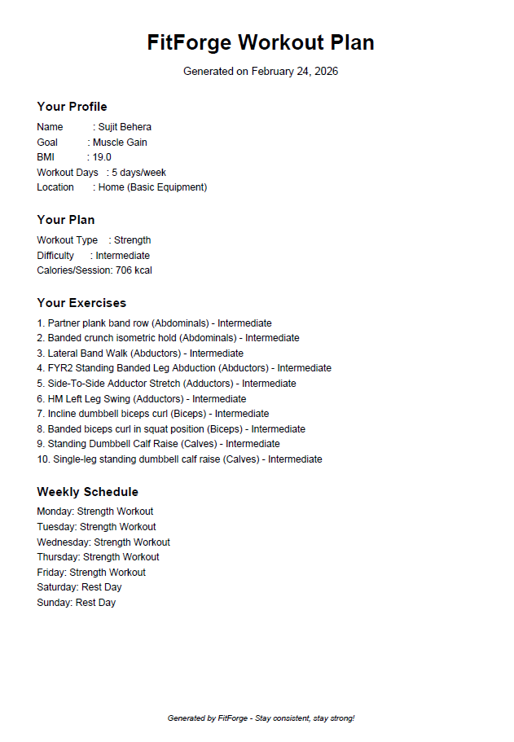

# 🏋️ FitForge — AI-Powered Personalized Workout Plan Generator


> A full-stack ML app that generates personalized workout plans.

## 🌟 Live Demo
🔗 **App:** [your streamlit link]
🔗 **API:** [https://fitforge-3.onrender.com/docs]

## 📸 Screenshots




## 📌 Table of Contents

- [About the Project](#about-the-project)
- [Features](#features)
- [Tech Stack](#tech-stack)
- [Project Structure](#project-structure)
- [How It Works](#how-it-works)
- [ML Models](#ml-models)
- [Installation](#installation)
- [Running Locally](#running-locally)
- [API Reference](#api-reference)
- [Dataset](#dataset)
- [Screenshots](#screenshots)
- [Author](#author)

---

## 🎯 About the Project

Most workout apps are either too generic or locked behind expensive subscriptions. **FitForge** solves this by using real machine learning to generate workout plans tailored to each user's age, weight, fitness goal, experience level, and available equipment.

The app was built end-to-end — from data cleaning and ML modeling to a REST API and an interactive web interface with PDF download.

---

## ✨ Features

- 🤖 **ML-Powered Calorie Predictor** — Random Forest Regressor with 86% R² score
- 🧠 **Smart Workout Recommender** — Rule-based engine using BMI, goal, and experience level
- 🏠 **Location-Aware Filtering** — Home (No Equipment), Home (Basic Equipment), or Gym
- 📋 **Exercise Library** — 2,900+ exercises filtered by body part, equipment, and difficulty
- 📅 **Weekly Schedule Generator** — Personalized day-by-day workout and rest day plan
- 🏥 **Health Advisory** — Tailored advice for each workout type
- 📥 **PDF Download** — Branded downloadable workout plan
- ⚡ **FastAPI Backend** — Production-ready REST API with interactive docs
- 🌐 **Streamlit Frontend** — Clean, interactive web UI

---

## 🛠️ Tech Stack

| Layer | Technology |
|---|---|
| Language | Python 3.10 |
| Machine Learning | Scikit-learn (Random Forest) |
| Data Processing | Pandas, NumPy |
| Backend API | FastAPI + Uvicorn |
| Frontend | Streamlit |
| PDF Generation | FPDF2 |
| Deployment | Render (API) + Streamlit Cloud (UI) |
| Version Control | Git + GitHub |

---

## 📁 Project Structure
```
FitForge/
│
├── data/
│   ├── exercise_clean.csv
│   ├── gym_members_clean.csv
│   ├── gym_members_exercise_tracking.csv
│   └── megaGymDataset.csv
│
├── models/
│   ├── calorie_model.pkl
│   ├── difficulty_model.pkl
│   ├── le_bodypart.pkl
│   ├── le_equipment.pkl
│   ├── le_gender.pkl
│   └── le_level.pkl
│
├── notebooks/
│   ├── phase1_eda.ipynb
│   └── phase2_model.ipynb
│
├── app/
│   ├── main.py
│   └── recommender.py
│
├── screenshots/
│   ├── app.png
│   ├── api.png
│   └── pdf.png
│
├── logo.png
├── streamlit_app.py
├── requirements.txt
└── README.md
```

---

## ⚙️ How It Works

```
User fills profile form (age, weight, goal, location...)
            ↓
[RULE ENGINE] → Recommend Workout Type (Cardio / Strength / HIIT / Yoga)
            ↓
[ML MODEL] → Predict Calories Burned per Session
            ↓
[EXERCISE FILTER] → Match exercises by type + equipment + difficulty
            ↓
Generate Weekly Plan → View on screen → Download as PDF
```

---

## 🤖 ML Models

### Model 1 — Calorie Predictor (Regression)
- **Algorithm:** Random Forest Regressor
- **Features:** Age, Gender, Weight, Height, BMI, Experience Level, Workout Frequency, Session Duration
- **Target:** Calories Burned per Session
- **Performance:** MAE = 85.67 kcal | R² = 0.86

### Model 2 — Workout Recommender (Rule-Based)
- Experience Level + Goal + BMI → Workout Type
- Chose rule-based over ML intentionally — the dataset lacked sufficient signal for reliable classification, and a transparent rule system is more explainable and trustworthy in a health context

### Exercise Filtering
- 2,918 exercises filtered by workout type, available equipment (based on location), and difficulty level
- Falls back gracefully if exact matches are insufficient

---

## 🚀 Installation

```bash
# Clone the repository
git clone https://github.com/YOUR_USERNAME/FitForge.git
cd FitForge

# Install dependencies
pip install -r requirements.txt
```

---

## 💻 Running Locally

You need **two terminals** running simultaneously:

**Terminal 1 — Start FastAPI backend:**
```bash
cd app
python -m uvicorn main:app --reload
```
API will run at: `http://127.0.0.1:8000`
API docs at: `http://127.0.0.1:8000/docs`

**Terminal 2 — Start Streamlit frontend:**
```bash
cd FitForge
python -m streamlit run streamlit_app.py
```
App will open at: `http://localhost:8501`

---

## 📡 API Reference

### `GET /`
Returns a welcome message.

### `GET /health`
Health check endpoint.

### `POST /recommend`
Generates a personalized workout recommendation.

**Request Body:**
```json
{
  "age": 25,
  "gender": "Male",
  "weight": 75,
  "height": 1.75,
  "bmi": 24.5,
  "experience_level": 1,
  "workout_frequency": 3,
  "session_duration": 1.0,
  "goal": "Weight Loss",
  "location": "Home (Basic Equipment)"
}
```

**Response:**
```json
{
  "status": "success",
  "workout_type": "Cardio",
  "calories": 731,
  "difficulty": "Beginner",
  "location": "Home (Basic Equipment)",
  "exercises": [
    {
      "Title": "Jumping rope",
      "BodyPart": "Quadriceps",
      "Equipment": "Body Only",
      "Level": "Intermediate"
    }
  ]
}
```

---

## 📊 Dataset

| Dataset | Source | Records |
|---|---|---|
| Gym Members Exercise | Kaggle | 973 members |
| Gym Exercise Library | Kaggle (MegaGym) | 2,918 exercises |

---

## 👨‍💻 Author

**Your Name**
📧 your.email@gmail.com
🔗 [LinkedIn](https://linkedin.com/in/yourprofile)
🐙 [GitHub](https://github.com/yourusername)

---

## 📄 License

This project is licensed under the MIT License.

---

> *Built with 💪 and a lot of data — FitForge: Stay consistent, stay strong!*